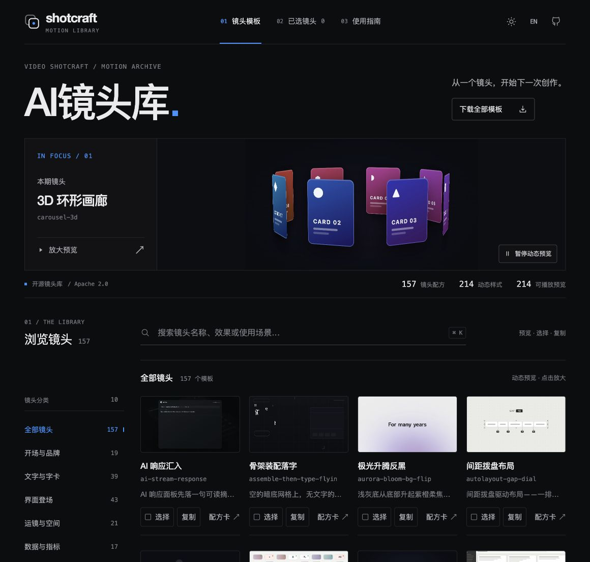
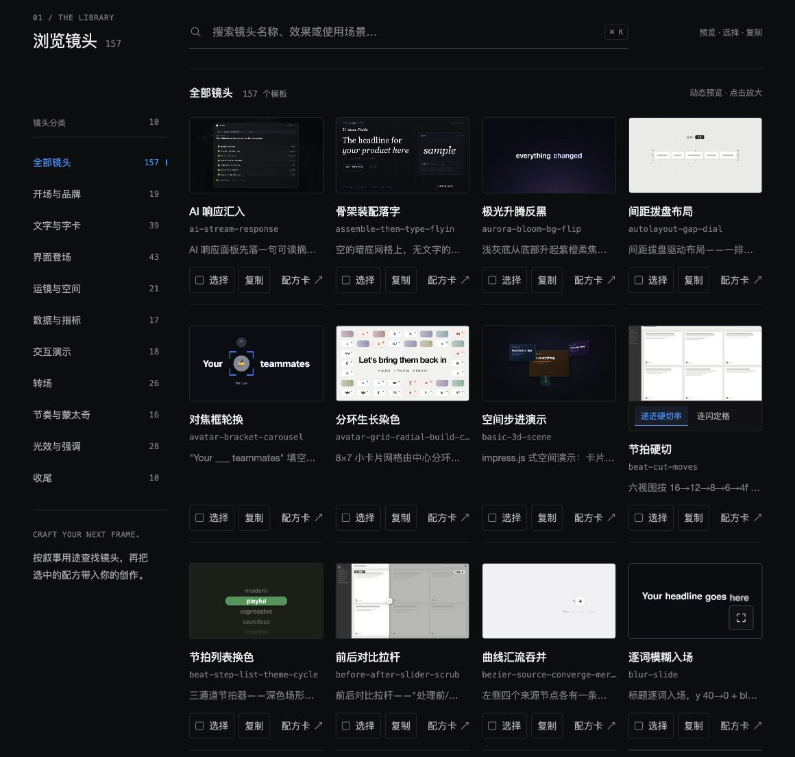
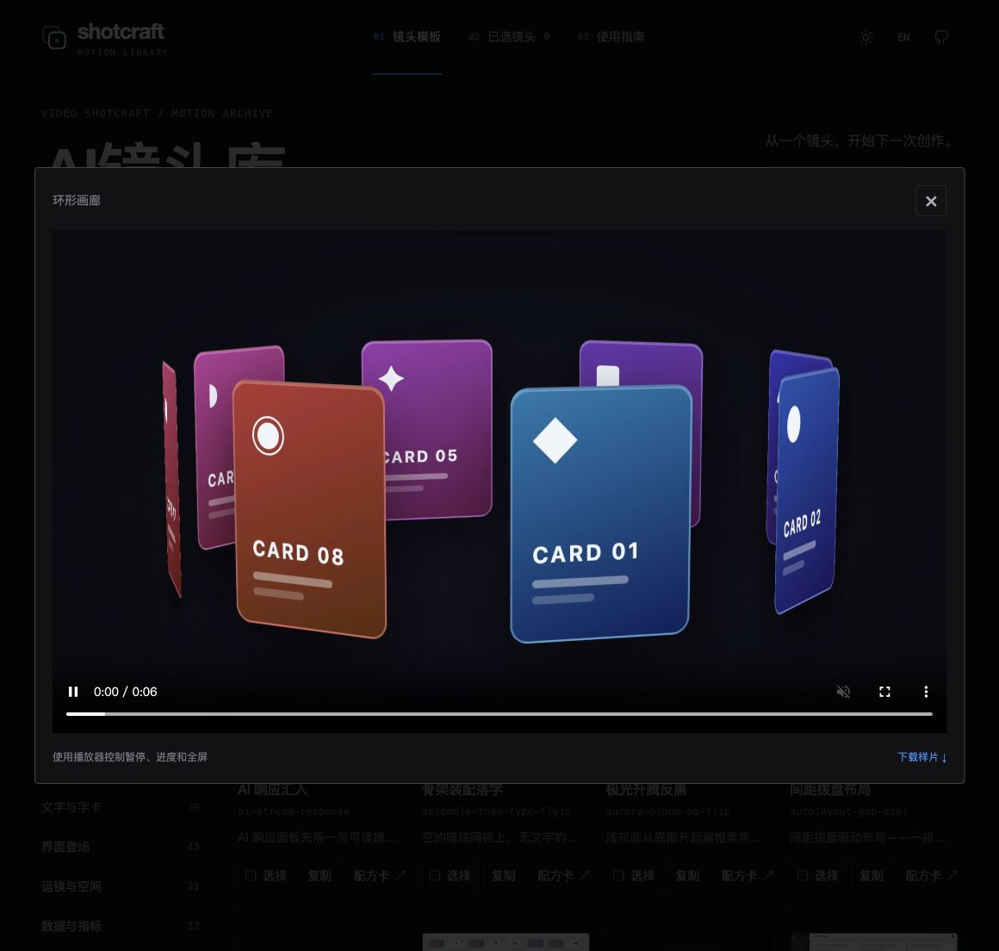

# AI镜头库

**从一个镜头，开始下一次创作。**

面向视频创作者与 AI 编程工作流的可视化镜头参考库，收录 **157 个镜头配方、214 种动态样式和 214 段 MP4 预览**。浏览效果、挑选镜头、复制名称，再将选中的配方用于你的创作。

本项目是 [Video Shotcraft](https://github.com/Vincentwei1021/video-shotcraft) 的独立网站衍生版本，提供中文优先的界面与完整本地预览资源。AI镜头库用于浏览和整理镜头参考；实际制作由你使用的创作工具或已配置 Video Shotcraft 的 AI 编程助手完成，无需在本站填写 API Key。

## 界面预览

以下图片均截取自实际运行的页面。

**首页：镜头库概览与本期动态镜头。**



**镜头列表：按分类浏览，切换样式、选择镜头或打开配方。**



**放大预览：查看镜头效果，控制播放进度并下载样片。**



## 能做什么

- **找镜头**：按 10 个分类筛选，支持中文、英文名称及关键词搜索。
- **看效果**：悬停播放、放大预览、切换同一镜头的不同样式，下载 MP4 样片。
- **选配方**：查看与下载 Markdown 配方，多选镜头并批量复制名称和当前样式。
- **舒服地浏览**：中英界面、深浅主题、桌面与移动端布局、全局暂停动态预览，并尊重系统的减少动态效果设置。
- **本地使用**：随项目提供 214 段视频与 214 张从原视频提取的 JPEG 预览图。

## 快速开始

需要 **Node.js 22 或更新版本**。项目使用原生 HTML、CSS、JavaScript 与 Node.js 内置模块，没有第三方运行依赖，无需执行 `npm install`。

下载并解压本仓库，进入项目目录后运行：

```bash
npm run dev
```

也可以直接执行 `node scripts/server.mjs`，然后打开 **[http://localhost:4173](http://localhost:4173)**。

页面需要通过 HTTP 读取目录 JSON 与配方，请使用本地服务打开。关闭运行服务的终端后，页面地址会停止提供服务；再次执行上述命令即可恢复。如果提示 `EADDRINUSE`，表示 4173 端口已有服务占用。

## 使用方式

1. 在分类中浏览，或搜索镜头名称、效果和使用场景。
2. 悬停卡片预览，点击放大；多样式镜头可切换样式。
3. 选择需要的镜头，点击「复制所选」；镜头英文标识与当前样式会一起复制。
4. 打开配方查看实现方法，或将镜头标识和内容需求交给已配置 Video Shotcraft 的 AI 编程助手。

页面「下载全部模板」链接指向[上游固定版本的完整源码 ZIP](https://codeload.github.com/Vincentwei1021/video-shotcraft/zip/5f047c7cfe10d6616fe59160a750fcfaea510b2e)，其中包含 Video Shotcraft 工具包和 Remotion 模板。**该按钮下载的是上游制作模板；本仓库保存的是可视化浏览网站。** 下载本网站，请使用仓库的 `Code → Download ZIP` 或发布页提供的网站源码包。

## 两种构建方式

| 命令 | 输出内容 | 预览视频来源 |
| --- | --- | --- |
| `npm run build:local` | 完整网站、配方、预览图及 MP4 | 本地 `media/` |
| `npm run build` | 精简网站、配方及预览图 | 上游公开视频地址，需要联网 |

构建结果位于 `dist/`。本地检查构建结果：

```bash
npm run build:local
npm start
```

完整本地版的浏览、搜索、配方和视频预览可离线使用；上游模板下载与 GitHub 等外部链接仍需网络。精简版适合静态托管，视频地址为 `https://vincentwei1021.github.io/video-shotcraft/media/`，可用性取决于上游服务。

两种构建都会生成 `index.html` 与 `library.html`。构建脚本会检查每个镜头引用的配方、视频和预览图是否存在；`dist/` 属于生成目录，不纳入源码仓库。

## 项目结构

```text
ai-shot-library/
├── index.html              页面结构
├── app.js                  搜索、筛选、预览与选择交互
├── design.css              响应式主题样式
├── translations.js         中文与英文文案
├── favicon.svg             站点图标
├── api/library.json        157 个镜头的目录与资源索引
├── source/                 157 份 Markdown 镜头配方
├── media/                  214 段 MP4 预览
├── posters/                214 张真实视频帧 JPEG
├── docs/screenshots/       实际页面截图
├── scripts/
│   ├── server.mjs          本地 HTTP 服务，支持视频 Range 请求
│   └── build.mjs           本地与精简托管构建
├── upstream-notices/       保留的上游素材与镜头来源声明
├── package.json            运行命令与项目元数据
├── LICENSE                 Apache License 2.0
└── NOTICE.txt              上游来源、修改与资源说明
```

## 来源与许可

感谢 **Wei Yihao / Vincentwei1021** 创建并开放 [Video Shotcraft](https://github.com/Vincentwei1021/video-shotcraft)。本项目基于上游版本 `5f047c7cfe10d6616fe59160a750fcfaea510b2e`，保留原镜头配方、翻译与预览内容，并调整网站布局、主题、选择与预览交互。214 张封面均从原 MP4 提取。

项目代码遵循 [Apache License 2.0](./LICENSE)，修改与资源来源详见 [NOTICE.txt](./NOTICE.txt)。上游音频、引用素材等资产仍需遵守各自的许可与署名要求；仓库保留了上游的[音频来源说明](./upstream-notices/audio-ATTRIBUTION.md)与[镜头来源说明](./upstream-notices/shots-ATTRIBUTION.md)原文；这两份文件原路径分别为 `assets/audio/ATTRIBUTION.md` 和 `references/shots/ATTRIBUTION.md`，其中涉及的制作工具及独立音频文件属于上游完整模板包。Remotion 使用其独立许可。

这是独立维护的衍生网站，保留 Shotcraft 来源标识，不代表上游作者的官方版本或背书。
